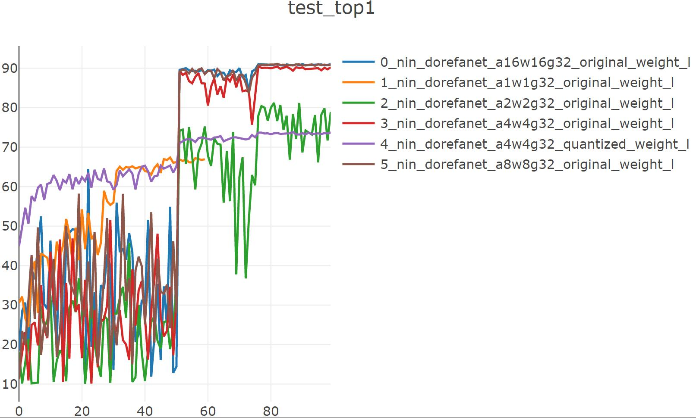
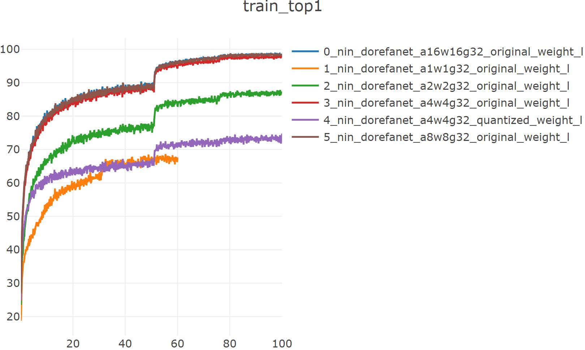
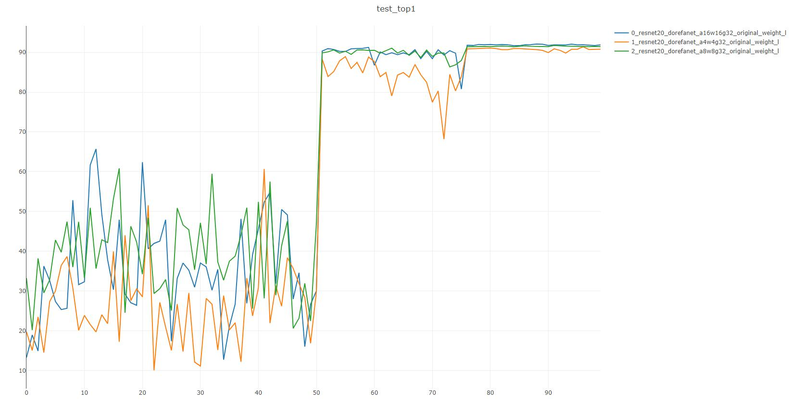
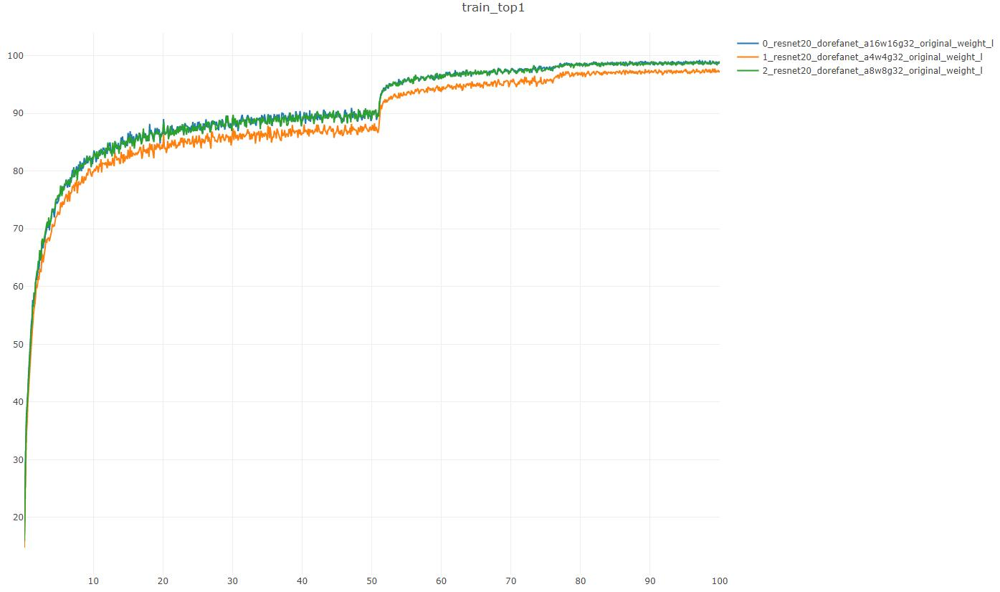

# pytorch-DoReFa-Net

[新版链接](quantize_README.md)

论文地址：[DoReFa-Net: Training Low Bitwidth Convolutional Neural Networks with Low Bitwidth Gradients](http://arxiv.org/abs/1606.06160)

## questions：

在全精度weight上更新在lr=0.1时训练集精度正常上升，测试集精度极低，训练一段时间lr自动调整为0.01后测试集精度骤升到接近训练集水平

若在量化后的weight上更新则没有此问题，但最终精度往往没有前者快

而且lr在某一值（0.1）训练epoch过多还会使训练集、测试集精度由上升转变为下降，甚至下降到随机初始化精度(cifar10 10%)，并且此时再改变lr无法提升精度

## experiments

### Network in Network

<!-- `python trainer_exp.py --arch nin_dorefanet --dataset cifar10 --lr 0.1 --valuate --epochs 60 --deterministic --workers 1 --gpu 2 --a_bits 1 --w_bits 1 --visdom --usr-suffix _original_weight_l` -->
`python trainer_exp.py --arch nin_quantized --dataset cifar10 --lr 0.1 --valuate --epochs 60 --deterministic --workers 1 --gpu 2 --quantize dorefa --a_bits 1 --w_bits 1 --visdom`

注：epochs=100的话在40~50期间训练集与测试集top会掉到10%且后续训练无法提升，故epochs改为60

==> Computational complexity:   17.11 MMac

==> Number of parameters:       674.91 k

Train:  59 [  50000/  50000 (100%)] loss:    0.93 | top1: 67.198% | load_time:   2% | lr   : 1.0e-03

Test:   59 [  10000/  10000 (100%)] loss:   0.934 | top1:  66.94% | load_time:  22% | UTC+8: 12:18:19

--------  nin_dorefanet  --  cifar10  --  best_top1: 67.370  --  duration:  0h:24.18  --------

best_acc1: 67.37

checkpoint_path: checkpoints/cifar10_nin_dorefanet_a1w1g32_original_weight_l_checkpoint.pth.tar

`python trainer_exp.py --arch nin_dorefanet --dataset cifar10 --lr 0.1 --valuate --epochs 100 --deterministic --workers 1 --gpu 0 --a_bits 2 --w_bits 2 --visdom --usr-suffix _original_weight_l`

==> Computational complexity:   17.11 MMac

==> Number of parameters:       674.91 k

Train:  99 [  50000/  50000 (100%)] loss:   0.382 | top1: 86.974% | load_time:   2% | lr   : 1.0e-03

Test:   99 [  10000/  10000 (100%)] loss:   0.639 | top1:  78.92% | load_time:  26% | UTC+8: 12:10:45

--------  nin_dorefanet  --  cifar10  --  best_top1: 81.220  --  duration:  0h:41.00  --------

best_acc1: 81.22

checkpoint_path: checkpoints/cifar10_nin_dorefanet_a2w2g32_original_weight_l_checkpoint.pth.tar

`python trainer_exp.py --arch nin_dorefanet --dataset cifar10 --lr 0.1 --valuate --epochs 20 --deterministic --workers 1 --gpu 2 --a_bits 4 --w_bits 4 --visdom --usr-suffix _original_weight`

==> Computational complexity:   17.11 MMac

==> Number of parameters:       674.91 k

Train:  99 [  50000/  50000 (100%)] loss:   0.083 | top1: 97.768% | load_time:   2% | lr   : 1.0e-03

Test:   99 [  10000/  10000 (100%)] loss:   0.309 | top1:  90.22% | load_time:  28% | UTC+8: 00:42:59

--------  nin_dorefanet  --  cifar10  --  best_top1: 90.450  --  duration:  0h:41.00  --------

best_acc1: 90.45

checkpoint_path: checkpoints/cifar10_nin_dorefanet_a4w4g32_original_weight_l_checkpoint.pth.tar

`python trainer_exp.py --arch nin_dorefanet --dataset cifar10 --lr 0.1 --valuate --epochs 20 --deterministic --workers 1 --gpu 0 --a_bits 4 --w_bits 4 --visdom --usr-suffix _quantized_weight`

==> Computational complexity:   17.11 MMac

==> Number of parameters:       674.91 k

Train:  99 [  50000/  50000 (100%)] loss:    0.77 | top1:  73.33% | load_time:   2% | lr   : 1.0e-03

Test:   99 [  10000/  10000 (100%)] loss:   0.752 | top1:  73.72% | load_time:  28% | UTC+8: 00:39:51

--------  nin_dorefanet  --  cifar10  --  best_top1: 73.840  --  duration:  0h:37.59  --------

best_acc1: 73.84

checkpoint_path: checkpoints/cifar10_nin_dorefanet_a4w4g32_quantized_weight_l_checkpoint.pth.tar

`python trainer_exp.py --arch nin_dorefanet --dataset cifar10 --lr 0.1 --valuate --epochs 100 --deterministic --workers 1 --gpu 0 --a_bits 8 --w_bits 8 --visdom --usr-suffix _original_weight_l`

==> Computational complexity:   17.11 MMac

==> Number of parameters:       674.91 k

Train:  99 [  50000/  50000 (100%)] loss:   0.067 | top1: 98.356% | load_time:   2% | lr   : 1.0e-03

Test:   99 [  10000/  10000 (100%)] loss:   0.302 | top1:  90.88% | load_time:  28% | UTC+8: 14:02:35

--------  nin_dorefanet  --  cifar10  --  best_top1: 91.090  --  duration:  0h:40.15  --------

best_acc1: 91.09

checkpoint_path: checkpoints/cifar10_nin_dorefanet_a8w8g32_original_weight_l_checkpoint.pth.tar

`python trainer_exp.py --arch nin_dorefanet --dataset cifar10 --lr 0.1 --valuate --epochs 100 --deterministic --workers 1 --gpu 0 --a_bits 16 --w_bits 16 --visdom --usr-suffix _original_weight_l`

==> Computational complexity:   17.11 MMac

==> Number of parameters:       674.91 k

Train:  99 [  50000/  50000 (100%)] loss:   0.065 | top1:  98.39% | load_time:   2% | lr   : 1.0e-03

Test:   99 [  10000/  10000 (100%)] loss:   0.287 | top1:  90.99% | load_time:  24% | UTC+8: 14:03:26

--------  nin_dorefanet  --  cifar10  --  best_top1: 91.040  --  duration:  0h:40.49  --------

best_acc1: 91.04

checkpoint_path: checkpoints/cifar10_nin_dorefanet_a16w16g32_original_weight_l_checkpoint.pth.tar

|          量化位数          | Computational complexity | Number of parameters | best_acc1 |
| :--------------------: | :----------------------: | :------------------: | :-------: |
|          a1w1          |        17.11 MMac        |       674.91 k       |   67.37   |
|          a2w2          |        17.11 MMac        |       674.91 k       |   81.22   |
|          a4w4          |        17.11 MMac        |       674.91 k       |   90.45   |
| a4w4(quantized weight) |        17.11 MMac        |       674.91 k       |   73.84   |
|          a8w8          |        17.11 MMac        |       674.91 k       |   91.09   |
|         a16w16         |        17.11 MMac        |       674.91 k       |   91.04   |

 注：由于没有专用的硬件平台和算法库，此处的量化均为先量化后反量化来模拟，故模型大小和flops不变

### resnet20

`python trainer_exp.py --arch resnet20_dorefanet --dataset cifar10 --lr 0.1 --valuate --epochs 100 --deterministic --workers 1 --gpu 1 --a_bits 4 --w_bits 4 --visdom --usr-suffix _original_weight_l`

==> Computational complexity:   1.35 MMac

==> Number of parameters:       1.11 M 

Train:  99 [  50000/  50000 (100%)] loss:   0.078 | top1: 97.328% | load_time:   2% | lr   : 1.0e-03

Test:   99 [  10000/  10000 (100%)] loss:    0.35 | top1:  90.79% | load_time:   5% | UTC+8: 15:14:46

--------  resnet20_dorefanet  --  cifar10  --  best_top1: 91.380  --  duration:  1h:02.01  --------

best_acc1: 91.38

checkpoint_path: checkpoints/cifar10_resnet20_dorefanet_a4w4g32_original_weight_l_checkpoint.pth.tar

`python trainer_exp.py --arch resnet20_dorefanet --dataset cifar10 --lr 0.1 --valuate --epochs 100 --deterministic --workers 1 --gpu 1 --a_bits 8 --w_bits 8 --visdom --usr-suffix _original_weight_l`

==> Computational complexity:   1.35 MMac

==> Number of parameters:       1.11 M 

Train:  99 [  50000/  50000 (100%)] loss:    0.04 | top1:  98.69% | load_time:   2% | lr   : 1.0e-03

Test:   99 [  10000/  10000 (100%)] loss:   0.333 | top1:  91.43% | load_time:   5% | UTC+8: 15:14:48

--------  resnet20_dorefanet  --  cifar10  --  best_top1: 91.720  --  duration:  1h:02.28  --------

best_acc1: 91.72

checkpoint_path: checkpoints/cifar10_resnet20_dorefanet_a8w8g32_original_weight_l_checkpoint.pth.tar

`python trainer_exp.py --arch resnet20_dorefanet --dataset cifar10 --lr 0.1 --valuate --epochs 100 --deterministic --workers 1 --gpu 1 --a_bits 16 --w_bits 16 --visdom --usr-suffix _original_weight_l`

==> Computational complexity:   1.35 MMac

==> Number of parameters:       1.11 M 

Train:  99 [  50000/  50000 (100%)] loss:   0.038 | top1: 98.784% | load_time:   1% | lr   : 1.0e-03

Test:   99 [  10000/  10000 (100%)] loss:   0.338 | top1:   91.9% | load_time:   5% | UTC+8: 15:09:31

--------  resnet20_dorefanet  --  cifar10  --  best_top1: 92.090  --  duration:  1h:00.46  --------

best_acc1: 92.09

checkpoint_path: checkpoints/cifar10_resnet20_dorefanet_a16w16g32_original_weight_l_checkpoint.pth.tar

|  bits  | Computational complexity | Number of parameters | best_acc1 |
| :----: | :----------------------: | :------------------: | :-------: |
|  a4w4  |        1.35 MMac         |        1.11 M        |   91.38   |
|  a8w8  |        1.35 MMac         |        1.11 M        |   91.72   |
| a16w16 |        1.35 MMac         |        1.11 M        |   92.09   |

 注：由于没有专用的硬件平台和算法库，此处的量化均为先量化后反量化来模拟，故模型大小和flops不变

