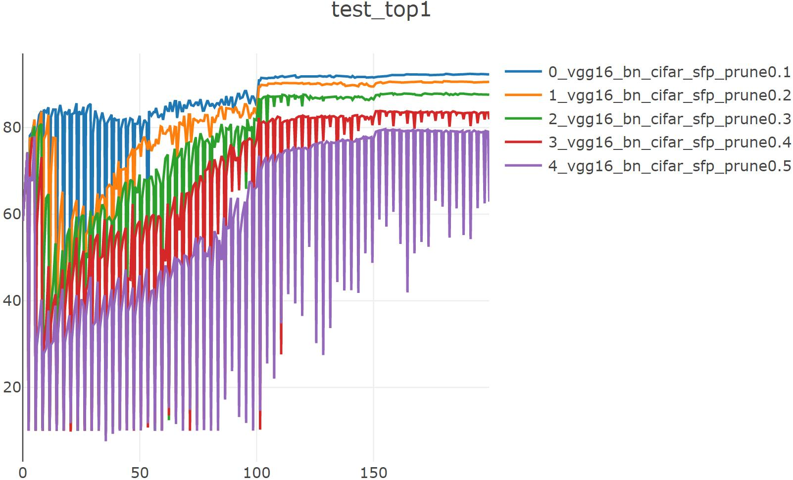
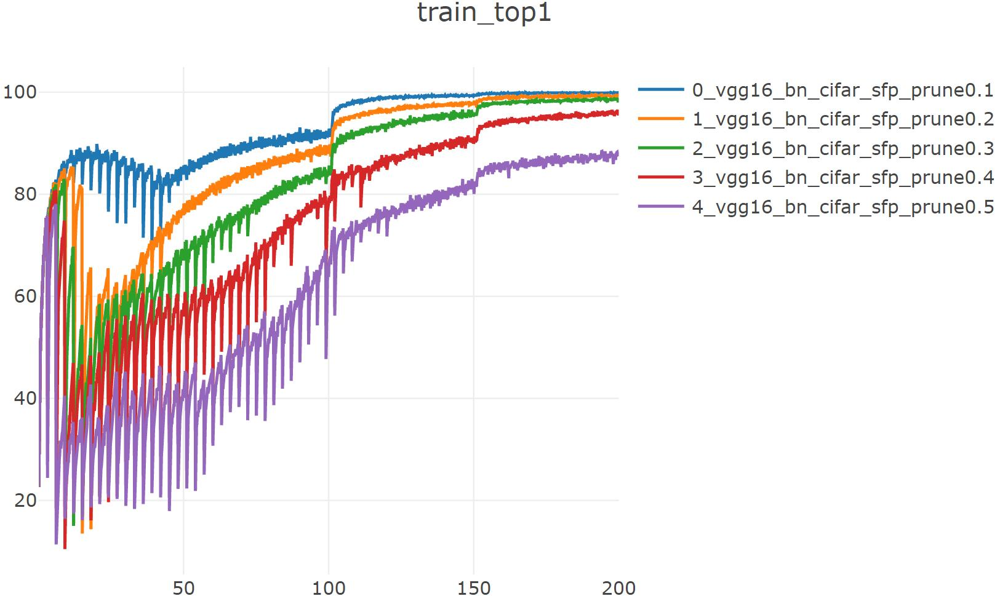

# pytorch-slimming

论文地址：[Soft Filter Pruning for Accelerating Deep Convolutional Neural Networks](https://arxiv.org/abs/1808.06866v1) (IJCAI2018)

## 实验（基于CIFAR10数据集）：

train&prune: ```python SFP_exp.py --json experiments/prune/cifar10_sfp_vgg16_bn.json --prune_percent 0.3 --gpu 2 --visdom```

fine-tuning: ```python trainer_exp.py --json experiments/prune/cifar10_sfp0.4_vgg16_bn_fine_tuning.json --gpu 6 --visdom```

|      ratio       | 0(Baseline) |  0.1   |  0.2   |  0.3   |  0.4  |  0.5  |
| :--------------: | :---------: | :----: | :----: | :----: | :---: | :---: |
| Top1 Accuracy(%) |    93.84    | 92.28  | 90.55  | 87.51  | 82.84 | 76.54 |
|  Parameters(M)   |    14.73    | 11.95  |  9.45  |  7.25  | 5.33  | 3.68  |
|   FLOPs(MMac)    |   314.43    | 256.38 | 203.16 | 155.57 | 114.8 | 79.22 |



