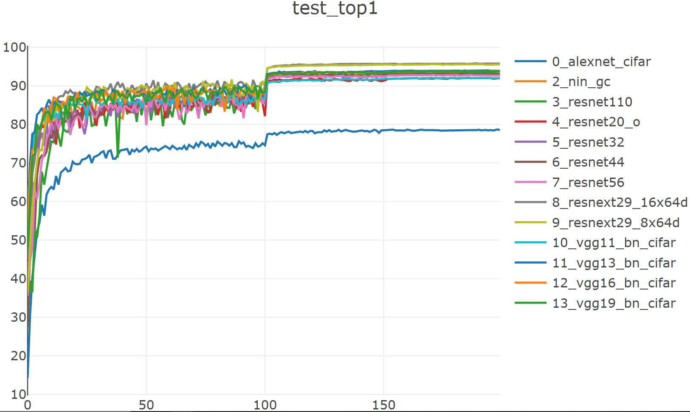
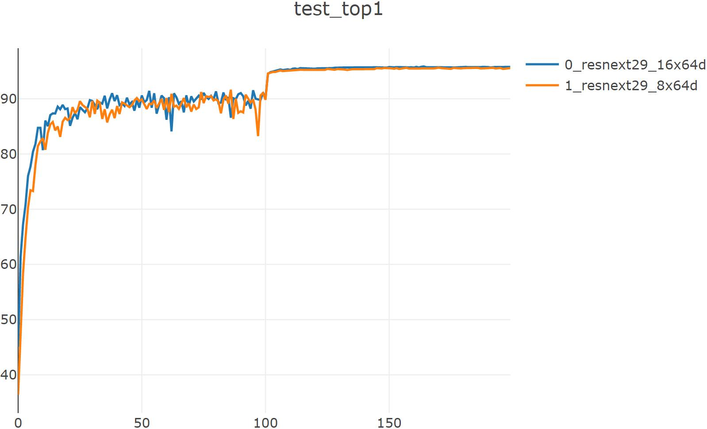
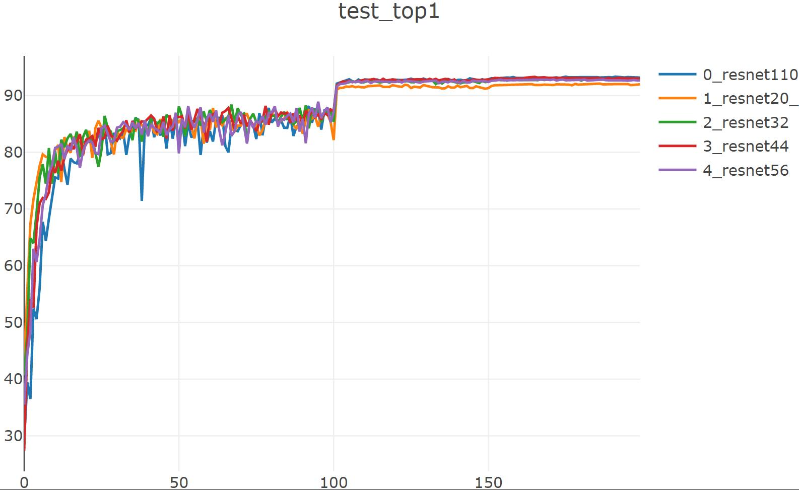
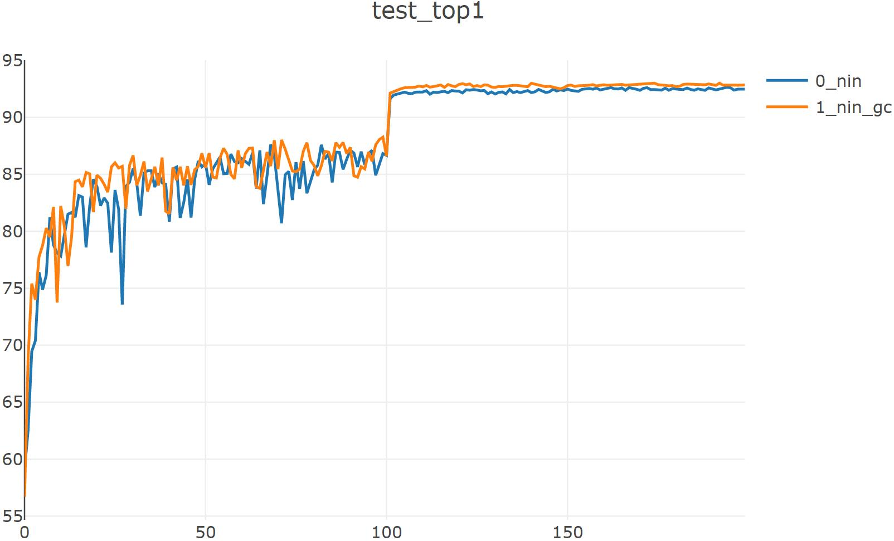
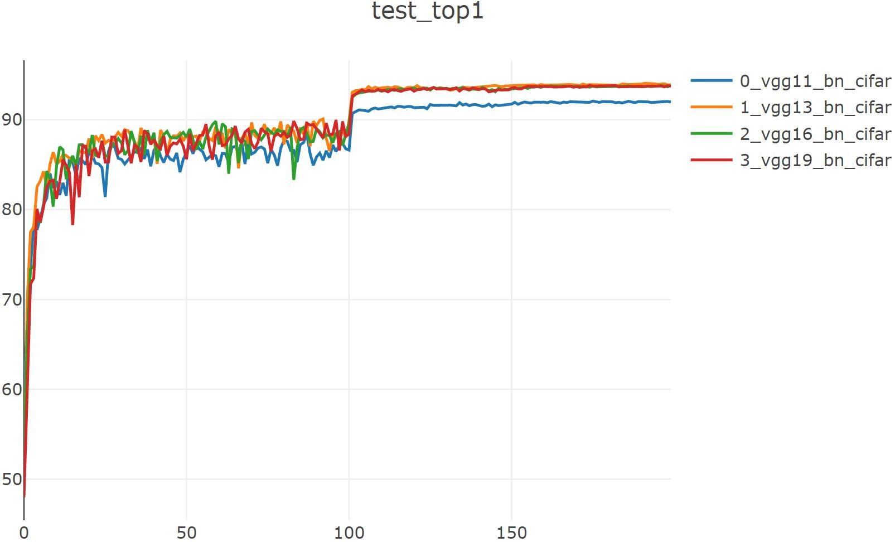

# BASELINE

## CIFAR10

|      model      |  params  | flops(MMac) | top1(%) | train&val duration(v100) |
| :-------------: | :------: | :---------: | :-----: | :----------------------: |
|    resnet20     | 272.28 k |    41.19    |  92.10  |         0h:48.59         |
|    resnet32     | 466.71 k |    69.74    |  92.95  |         1h:01.37         |
|    resnet44     | 611.15 k |    98.28    |  93.29  |         1h:15.01         |
|    resnet56     | 855.58 k |   126.82    |  92.86  |         1h:31.02         |
|    resnet110    |  1.15 M  |   169.63    |  93.32  |         1h:52.12         |
|   resnet20(w)   |  1.11 M  |   159.95    |  94.04  |         0h:55.04         |
|   resnet32(w)   |  1.89 M  |   273.77    |  94.48  |         1h:21.15         |
|   resnet44(w)   |  2.66 M  |   387.59    |  94.49  |         1h:48.00         |
|       nin       | 674.91 k |   149.66    |  92.64  |         0h:47.05         |
|     nin_gc      | 591.39 k |   163.32    |  93.00  |         1h:07.55         |
|    VGG11_bn     |  9.23 M  |    153.5    |  92.08  |         0h:48.32         |
|    VGG13_bn     |  9.42 M  |   229.39    |  94.07  |         0h:47.22         |
|    VGG16_bn     | 14.73 M  |   314.43    |  93.84  |         0h:57.55         |
|    VGG19_bn     | 20.04 M  |   399.47    |  93.83  |         1h:10.05         |
|     alexnet     | 129.25 k |    1.34     |  78.69  |         0h:44.29         |
| resnex29_8x64d  | 34.43 M  |    84.81    |  95.64  |        10h:49.11         |
| resnex29_16x64d | 68.16 M  |    84.81    |  95.85  |        20h:24.12         |

### resnext

#### resnext29_8x64d

python trainer_exp.py --json experiments/baseline/cifar10_resnext29_8x64d.json --gpu 0 --visdom

==> Computational complexity:   84.81 MMac

==> Number of parameters:       34.43 M

Train: 199 [  50000/  50000 (100%)] loss:   0.001 | top1:  100.0% | load_time:   0% | lr   : 1.0e-03

Test:  199 [  10000/  10000 (100%)] loss:   0.168 | top1:  95.55% | load_time:   1% | UTC+8: 02:41:24

--------  cifar10_resnext29_8x64d  --  best_top1: 95.64  --  duration: 10h:49.11  --------

best_acc1: 95.64

#### resnext29_16x64d

python trainer_exp.py --json experiments/baseline/cifar10_resnext29_16x64d.json --gpu 2 --visdom

==> Computational complexity:   84.81 MMac

==> Number of parameters:       68.16 M

Train: 199 [  50000/  50000 (100%)] loss:   0.001 | top1:  100.0% | load_time:   0% | lr   : 1.0e-03

Test:  199 [  10000/  10000 (100%)] loss:   0.159 | top1:  95.78% | load_time:   0% | UTC+8: 13:39:51

--------  cifar10_resnext29_16x64d  --  best_top1: 95.85  --  duration: 20h:24.12  --------

best_acc1: 95.85

|      model      |  params  | flops(MMac) | top1(%) | train&val duration(v100) |
| :-------------: | :------: | :---------: | :-----: | :----------------------: |
| resnex29_8x64d  | 34.43 M  |    84.81    |  95.64  |        10h:49.11         |
| resnex29_16x64d | 68.16 M  |    84.81    |  95.85  |        20h:24.12         |

### resnet

#### resnet20

python trainer_exp.py --json experiments/baseline/cifar10_resnet20.json --gpu 2 --visdom

==> Computational complexity:   41.19 MMac

==> Number of parameters:       272.28 k

Train: 199 [  50000/  50000 (100%)] loss:   0.018 | top1: 99.516% | load_time:   8% | lr   : 1.0e-03

Test:  199 [  10000/  10000 (100%)] loss:   0.358 | top1:  91.97% | load_time:  65% | UTC+8: 11:53:07

--------  cifar10_resnet20_o  --  best_top1: 92.100  --  duration:  0h:48.59  --------

best_acc1: 92.1

#### resnet32

python trainer_exp.py --json experiments/baseline/cifar10_resnet32.json --gpu 0 --visdom

==> Computational complexity:   69.74 MMac

==> Number of parameters:       466.71 k

Train: 199 [  50000/  50000 (100%)] loss:   0.007 | top1: 99.868% | load_time:   3% | lr   : 1.0e-03

Test:  199 [  10000/  10000 (100%)] loss:   0.334 | top1:   92.8% | load_time:  50% | UTC+8: 12:49:49

--------  cifar10_resnet32  --  best_top1: 92.950  --  duration:  1h:01.37  --------

best_acc1: 92.95

#### resnet44

python trainer_exp.py --json experiments/baseline/cifar10_resnet44.json --gpu 3 --visdom

==> Computational complexity:   98.28 MMac

==> Number of parameters:       661.15 k

Train: 199 [  50000/  50000 (100%)] loss:   0.005 | top1:  99.87% | load_time:   2% | lr   : 1.0e-03

Test:  199 [  10000/  10000 (100%)] loss:   0.317 | top1:  93.01% | load_time:  41% | UTC+8: 13:04:32

--------  cifar10_resnet44  --  best_top1: 93.290  --  duration:  1h:15.01  --------

best_acc1: 93.29

#### resnet56

python trainer_exp.py --json experiments/baseline/cifar10_resnet56.json --gpu 1 --visdom

==> Computational complexity:   126.82 MMac

==> Number of parameters:       855.58 k

Train: 199 [  50000/  50000 (100%)] loss:   0.004 | top1: 99.926% | load_time:   2% | lr   : 1.0e-03

Test:  199 [  10000/  10000 (100%)] loss:   0.346 | top1:  92.66% | load_time:  42% | UTC+8: 13:18:03

--------  cifar10_resnet56  --  best_top1: 92.860  --  duration:  1h:31.02  --------

best_acc1: 92.86

#### resnet110

python trainer_exp.py --json experiments/baseline/cifar10_resnet110.json --gpu 2 --visdom

==> Computational complexity:   169.63 MMac

==> Number of parameters:       1.15 M

Train: 199 [  50000/  50000 (100%)] loss:   0.004 | top1: 99.936% | load_time:   2% | lr   : 1.0e-03

Test:  199 [  10000/  10000 (100%)] loss:   0.334 | top1:  93.16% | load_time:  39% | UTC+8: 13:45:58

--------  cifar10_resnet110  --  best_top1: 93.320  --  duration:  1h:52.12  --------

best_acc1: 93.32

#### resnet20(W)

wide版本，需要修改model代码：stage_channels = [16, 64, 128, 256]，且basicneck.expansion = 4

python trainer_exp.py --json experiments/baseline/cifar10_resnet20.json --gpu 0

==> Computational complexity:   159.95 MMac

==> Number of parameters:       1.11 M

Train: 199 [  50000/  50000 (100%)] loss:   0.003 | top1: 99.972% | load_time:   3% | lr   : 1.0e-03

Test:  199 [  10000/  10000 (100%)] loss:   0.265 | top1:  93.86% | load_time:  65% | UTC+8: 21:35:35

--------  cifar10_resnet20_forward  --  best_top1: 94.040  --  duration:  0h:55.04  --------

best_acc1: 94.04

#### resnet32(W)

wide版本，需要修改model代码：stage_channels = [16, 64, 128, 256]，且basicneck.expansion = 4

python trainer_exp.py --json experiments/baseline/cifar10_resnet32.json --gpu 0

==> Computational complexity:   273.77 MMac

==> Number of parameters:       1.89 M

Train: 199 [  50000/  50000 (100%)] loss:   0.002 | top1: 99.982% | load_time:   2% | lr   : 1.0e-03

Test:  199 [  10000/  10000 (100%)] loss:    0.24 | top1:   94.4% | load_time:  39% | UTC+8: 23:16:11

--------  cifar10_resnet32  --  best_top1: 94.480  --  duration:  1h:21.15  --------

best_acc1: 94.48

#### resnet44(W)

wide版本，需要修改model代码：stage_channels = [16, 64, 128, 256]，且basicneck.expansion = 4

python trainer_exp.py --json experiments/baseline/cifar10_resnet44.json --gpu 2

==> Computational complexity:   387.59 MMac

==> Number of parameters:       2.66 M

Train: 199 [  50000/  50000 (100%)] loss:   0.002 | top1: 99.986% | load_time:   2% | lr   : 1.0e-03

Test:  199 [  10000/  10000 (100%)] loss:   0.247 | top1:  94.38% | load_time:  12% | UTC+8: 23:43:00

--------  cifar10_resnet44  --  best_top1: 94.490  --  duration:  1h:48.00  --------

best_acc1: 94.49

|    model    |  params  | flops(MMac) | top1(%) | train&val duration(v100) |
| :---------: | :------: | :---------: | :-----: | :----------------------: |
|  resnet20   | 272.28 k |    41.19    |  92.10  |         0h:48.59         |
|  resnet32   | 466.71 k |    69.74    |  92.95  |         1h:01.37         |
|  resnet44   | 611.15 k |    98.28    |  93.29  |         1h:15.01         |
|  resnet56   | 855.58 k |   126.82    |  92.86  |         1h:31.02         |
|  resnet110  |  1.15 M  |   169.63    |  93.32  |         1h:52.12         |
| resnet20(w) |  1.11 M  |   159.95    |  94.04  |         0h:55.04         |
| resnet32(w) |  1.89 M  |   273.77    |  94.48  |         1h:21.15         |
| resnet44(w) |  2.66 M  |   387.59    |  94.49  |         1h:48.00         |

resnet(W)未记录visdom数据

### nin(network in network)

#### nin

python trainer_exp.py --json experiments/baseline/cifar10_nin.json --gpu 0 --visdom

==> Computational complexity:   149.66 MMac

==> Number of parameters:       674.91 k

Train: 199 [  50000/  50000 (100%)] loss:   0.014 | top1: 99.918% | load_time:  12% | lr   : 1.0e-03

Test:  199 [  10000/  10000 (100%)] loss:   0.253 | top1:  92.48% | load_time:  65% | UTC+8: 14:34:21

--------  cifar10_nin  --  best_top1: 92.640  --  duration:  0h:47.05  --------

best_acc1: 92.64

#### nin_gc(group channel)

python trainer_exp.py --json experiments/baseline/cifar10_nin_gc.json --gpu 1 --visdom

==> Computational complexity:   163.32 MMac

==> Number of parameters:       591.39 k

Train: 199 [  50000/  50000 (100%)] loss:   0.014 | top1: 99.942% | load_time:   3% | lr   : 1.0e-03

Test:  199 [  10000/  10000 (100%)] loss:    0.23 | top1:  92.84% | load_time:  42% | UTC+8: 14:55:44

--------  cifar10_nin_gc  --  best_top1: 93.000  --  duration:  1h:07.55  --------

best_acc1: 93.0

|    model    |  params  | flops(MMac) | top1(%) | train&val duration(v100) |
| :---------: | :------: | :---------: | :-----: | :----------------------: |
|     nin     | 674.91 k |   149.66    |  92.64  |         0h:47.05         |
|   nin_gc    | 591.39 k |   163.32    |  93.00  |         1h:07.55         |

### VGG

#### VGG11_bn

python trainer_exp.py --json experiments/baseline/cifar10_vgg11_bn.json --gpu 3 --visdom

==> Computational complexity:   153.5 MMac

==> Number of parameters:       9.23 M

Train: 199 [  50000/  50000 (100%)] loss:   0.002 | top1: 99.968% | load_time:  28% | lr   : 1.0e-03

Test:  199 [  10000/  10000 (100%)] loss:   0.362 | top1:  91.98% | load_time:  70% | UTC+8: 14:52:07

--------  cifar10_vgg11_bn_cifar  --  best_top1: 92.080  --  duration:  0h:48.32  --------

best_acc1: 92.08

#### VGG13_bn

python trainer_exp.py --json experiments/baseline/cifar10_vgg13_bn.json --gpu 2 --visdom

==> Computational complexity:   229.39 MMac

==> Number of parameters:       9.42 M

Train: 199 [  50000/  50000 (100%)] loss:   0.001 | top1:  99.98% | load_time:   8% | lr   : 1.0e-03

Test:  199 [  10000/  10000 (100%)] loss:   0.272 | top1:   93.9% | load_time:  56% | UTC+8: 14:54:44

--------  cifar10_vgg13_bn_cifar  --  best_top1: 94.070  --  duration:  0h:47.22  --------

best_acc1: 94.07

#### VGG16_bn

python trainer_exp.py --json experiments/baseline/cifar10_vgg16_bn.json --gpu 0 --visdom

==> Computational complexity:   314.43 MMac

==> Number of parameters:       14.73 M

Train: 199 [  50000/  50000 (100%)] loss:   0.001 | top1: 99.974% | load_time:   3% | lr   : 1.0e-03

Test:  199 [  10000/  10000 (100%)] loss:   0.307 | top1:  93.82% | load_time:  44% | UTC+8: 15:39:52

--------  cifar10_vgg16_bn_cifar  --  best_top1: 93.840  --  duration:  0h:57.55  --------

best_acc1: 93.84

#### VGG19_bn

python trainer_exp.py --json experiments/baseline/cifar10_vgg19_bn.json --gpu 3 --visdom

==> Computational complexity:   399.47 MMac

==> Number of parameters:       20.04 M

Train: 199 [  50000/  50000 (100%)] loss:   0.001 | top1: 99.988% | load_time:   3% | lr   : 1.0e-03

Test:  199 [  10000/  10000 (100%)] loss:   0.328 | top1:  93.76% | load_time:  28% | UTC+8: 16:02:47

--------  cifar10_vgg19_bn_cifar  --  best_top1: 93.83  --  duration:  1h:10.05  --------

best_acc1: 93.83

|    model    |  params  | flops(MMac) | top1(%) | train&val duration(v100) |
| :---------: | :------: | :---------: | :-----: | :----------------------: |
|  VGG11_bn   |  9.23 M  |    153.5    |  92.08  |         0h:48.32         |
|  VGG13_bn   |  9.42 M  |   229.39    |  94.07  |         0h:47.22         |
|  VGG16_bn   | 14.73 M  |   314.43    |  93.84  |         0h:57.55         |
|  VGG19_bn   | 20.04 M  |   399.47    |  93.83  |         1h:10.05         |

### Alexnet

python trainer_exp.py --json experiments/baseline/cifar10_alexnet.json --gpu 1 --visdom

==> Computational complexity:   1.34 MMac

==> Number of parameters:       129.25 k

Train: 199 [  50000/  50000 (100%)] loss:    0.44 | top1: 84.352% | load_time:  61% | lr   : 1.0e-04

Test:  199 [  10000/  10000 (100%)] loss:   0.662 | top1:  78.51% | load_time:  84% | UTC+8: 17:04:15

--------  cifar10_alexnet_cifar  --  best_top1: 78.69  --  duration:  0h:44.29  --------

best_acc1: 78.69

|      model      |  params  | flops(MMac) | top1(%) | train&val duration(v100) |
| :-------------: | :------: | :---------: | :-----: | :----------------------: |
|     alexnet     | 129.25 k |    1.34     |  78.69  |         0h:44.29         |

## Imagenet

### ResNet

#### ResNet18

python trainer_exp.py --json experiments/baseline/imagenet_resnet18.json --gpu 0 --visdom

==> Computational complexity:   1.82 GMac

==> Number of parameters:       11.69 M

#### ResNet34

python trainer_exp.py --json experiments/baseline/imagenet_resnet34.json --gpu 2 --visdom

==> Computational complexity:   3.67 GMac

==> Number of parameters:       21.8 M

### MobileNet V2

python trainer_exp.py --json experiments/baseline/imagenet_mobilenetv2.json --gpu 3 --visdom

==> Computational complexity:   320.24 MMac

==> Number of parameters:       3.5 M
