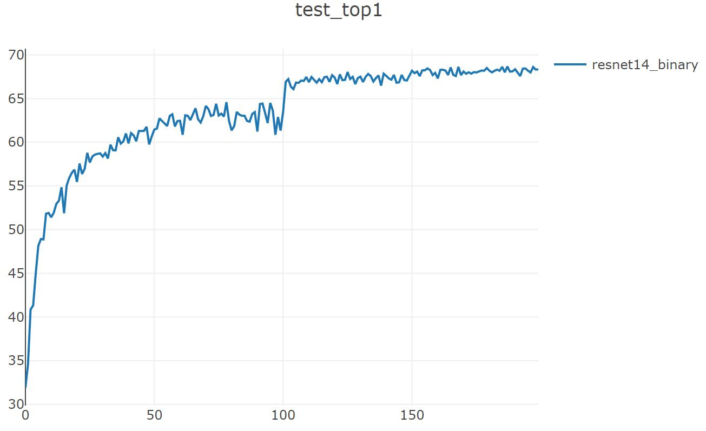

# pytorch-BNN

论文地址：[Binarized Neural Networks: Training Deep Neural Networks with Weights and Activations Constrained to +1 or -1](https://arxiv.org/abs/1602.02830v3)

参考代码：https://github.com/itayhubara/BinaryNet.pytorch

`python trainer_exp.py --gpu 1 --arch resnet14_binarynet --dataset cifar10 --valuate --binary --visdom`

Train: 199 [  50000/  50000 (100%)] loss:   0.826 | top1: 70.946% | load_time:   6% | lr   : 1.0e-03

Test:  199 [  10000/  10000 (100%)] loss:   0.911 | top1:  68.34% | load_time:  38% | UTC+8: 14:48:20

--------  model: resnet14_binary  --  dataset: cifar10  --  duration:  1h:01.51  --------

best_acc1: 68.67

