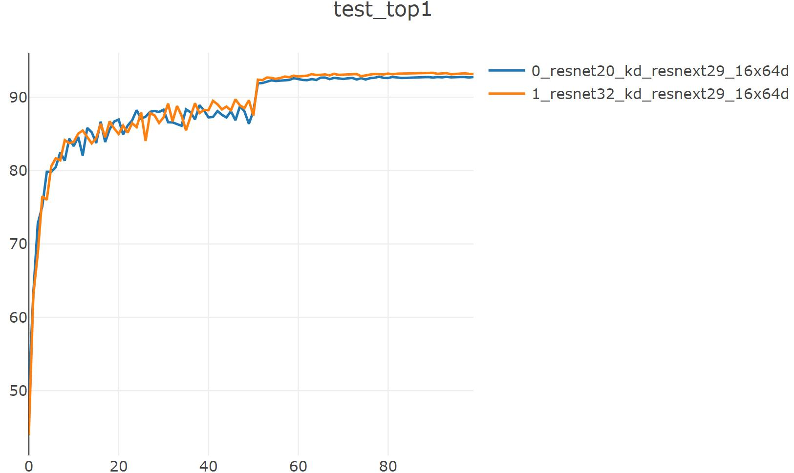

# distill

## resnet20 to nin

python distiller_exp.py --json experiments/distill/cifar10_resnet20-nin_distill.json --gpu 1

==> Computational complexity:   149.66 MMac

==> Number of parameters:       674.91 k

Train:  99 [  50000/  50000 (100%)] loss:   2.291 | top1: 91.734% | load_time:   5% | lr   : 1.0e-03

Test:   99 [  10000/  10000 (100%)] loss:   0.584 | top1:  88.77% | load_time:  65% | UTC+8: 22:07:03

--------  cifar10_nin_kd_resnet20  --  best_top1: 88.850  --  duration:  0h:22.03  --------

best_acc1: 88.85

## vgg13_bn_cifar to alexnet

python distiller_exp.py --json experiments/distill/cifar10_vgg13_bn-alexnet_distill.json --gpu 3 --visdom

==> Computational complexity:   1.34 MMac

==> Number of parameters:       129.25 k

Train:  99 [  50000/  50000 (100%)] loss:   0.402 | top1: 79.166% | load_time:   4% | lr   : 1.0e-03

Test:   99 [  10000/  10000 (100%)] loss:   0.956 | top1:  77.81% | load_time:  83% | UTC+8: 09:00:26

--------  cifar10_alexnet_cifar_kd_vgg13_bn_cifar  --  best_top1: 78.07  --  duration:  0h:24.50  --------

best_acc1: 78.07

## cifar10_resnext to resnet20

|     model     | resnet20(baseline) | resnext29_16x64d(teacher) | resnet20(stuedent) |
| :-----------: | :----------------: | :-----------------------: | :----------------: |
|    Top1(%)    |       92.10        |           95.85           |       92.81        |
| Parameters(M) |      0.27228       |           68.16           |      0.27228       |
|  Flops(MMac)  |       41.19        |           84.81           |       41.19        |

python distiller_exp.py --json experiments/distill/cifar10_resnext-resnet20_distill.json --gpu 1 --visdom

==> Computational complexity:   41.19 MMac

==> Number of parameters:       272.28 k

Train:  99 [  50000/  50000 (100%)] loss:   0.097 | top1: 97.652% | load_time:   0% | lr   : 1.0e-03

Test:   99 [  10000/  10000 (100%)] loss:   0.339 | top1:  92.77% | load_time:  65% | UTC+8: 23:15:16

--------  cifar10_resnet20_kd_resnext29_16x64d  --  best_top1: 92.81  --  duration:  9h:39.46  --------

best_acc1: 92.81

## cifar10_resnext to resnet32

|     model     | resnet32(baseline) | resnext29_16x64d(teacher) | resnet32(stuedent) |
| :-----------: | :----------------: | :-----------------------: | :----------------: |
|    Top1(%)    |       92.95        |           95.85           |                    |
| Parameters(M) |      0.46671       |           68.16           |      0.46671       |
|  Flops(MMac)  |       69.74        |           84.81           |       69.74        |

python distiller_exp.py --json experiments/distill/cifar10_resnext-resnet32_distill.json --gpu 1 --visdom

==> Computational complexity:   69.74 MMac

==> Number of parameters:       466.71 k

Train:  99 [  50000/  50000 (100%)] loss:   0.078 | top1: 98.786% | load_time:   0% | lr   : 1.0e-03

Test:   99 [  10000/  10000 (100%)] loss:   0.337 | top1:  93.18% | load_time:  47% | UTC+8: 09:22:23

--------  cifar10_resnet32_kd_resnext29_16x64d  --  best_top1: 93.33  --  duration:  9h:47.49  --------

best_acc1: 93.33

## 训练可视化

