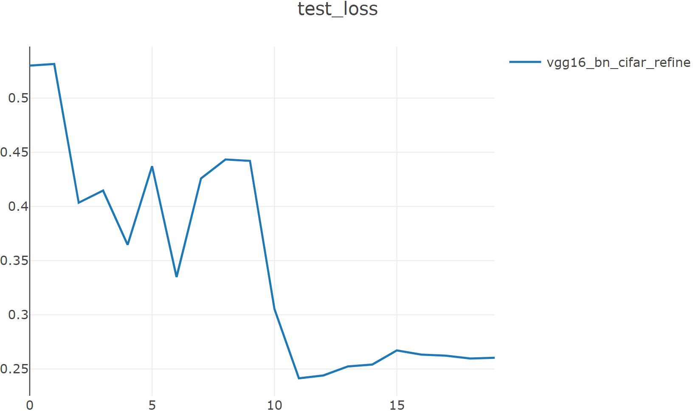
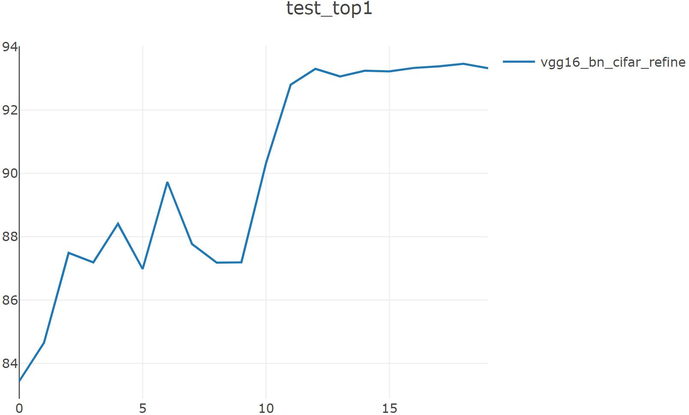

# pytorch-l1_filter_prune

论文地址：[Pruning Filters for Efficient ConvNets](https://arxiv.org/abs/1608.08710) (ICLR 2017)

## 实验（基于CIFAR10数据集）：

### vgg16_bn_cifar

training(最新见[baseline](baseline_README.md)): ```python trainer_exp.py --json experiments/baseline/cifar10_vgg16_bn.json --gpu 0 --visdom```

pruning: ```python pruner_exp.py --json experiments/prune/cifar10_filter_prune_vgg16_bn.json --gpu 7```

fine-tuning: ```python trainer_exp.py --json experiments/prune/cifar10_filter_prune_vgg16_bn_fine_tuning.json --visdom --gpu 3```

|  vgg16_bn_cifar  | Baseline | pruned (ratio=0.37) | Fine-tuned (20epochs) |
| :--------------: | :------: | :-----------------: | :-------------------: |
| Top1 Accuracy(%) |  93.84   |        53.21        |        93.46          |
|  Parameters(M)   |  14.73   |        5.26         |         5.26          |
|   FLOPs(MMac)    |  314.43  |       227.07        |        227.07         |

|  Pruned Ratio |                                 architecture                                        |
| :-----------: | :---------------------------------------------------------------------------------: |
|       0       | [64, 64, 'M', 128, 128, 'M', 256, 256, 256, 'M', 512, 512, 512, 'M', 512, 512, 512] |
|    0.37121    | [32, 64, 'M', 128, 128, 'M', 256, 256, 256, 'M', 256, 256, 256, 'M', 256, 256, 256] |

## fine-tuning：

### test_loss(交叉熵):



### test_top1:

