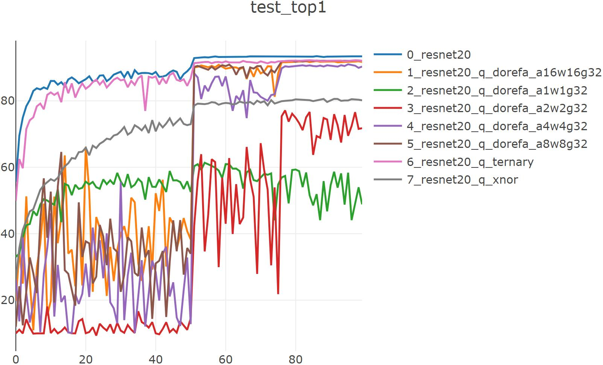
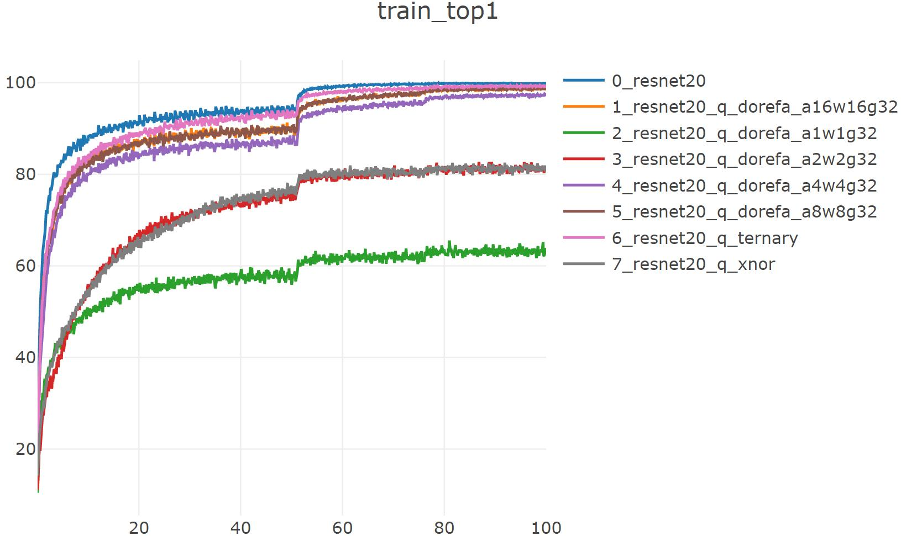

# pytorch-quantize

论文地址：[XNOR-Net: ImageNet Classification Using Binary Convolutional Neural Networks](https://arxiv.org/abs/1603.05279v4)

论文地址：[DoReFa-Net: Training Low Bitwidth Convolutional Neural Networks with Low Bitwidth Gradients](http://arxiv.org/abs/1606.06160)

论文地址：[Ternary Weight Networks](http://arxiv.org/abs/1605.04711)

参考代码：https://github.com/jiecaoyu/XNOR-Net-PyTorch

## nin

### xnornet

### dorefa

## resnet20

### baseline

`python trainer_exp.py --arch resnet20 --dataset cifar10 --lr 0.1 --valuate --epochs 100 --deterministic --workers 1 --gpu 3 --visdom`

==> Computational complexity:   159.95 MMac

==> Number of parameters:       1.11 M

Train:  99 [  50000/  50000 (100%)] loss:   0.007 | top1: 99.884% | load_time:   3% | lr   : 1.0e-03

Test:   99 [  10000/  10000 (100%)] loss:    0.28 | top1:  93.38% | load_time:  56% | UTC+8: 14:40:53

--------  cifar10_resnet20  --  best_top1: 93.450  --  duration:  0h:26.55  --------

best_acc1: 93.45

checkpoint_path: checkpoints/cifar10_resnet20_checkpoint.pth.tar

### xnornet

`python trainer_exp.py --arch resnet20_q --dataset cifar10 --lr 0.1 --valuate --epochs 100 --deterministic --workers 1 --gpu 1 --visdom --quantize xnor`

==> Computational complexity:   1.35 MMac

==> Number of parameters:       1.11 M

Train:  99 [  50000/  50000 (100%)] loss:   0.539 | top1: 81.232% | load_time:   2% | lr   : 1.0e-03

Test:   99 [  10000/  10000 (100%)] loss:   0.577 | top1:  80.17% | load_time:  39% | UTC+8: 12:00:23

--------  cifar10_resnet20_q_xnor  --  best_top1: 80.600  --  duration:  0h:39.06  --------

best_acc1: 80.6

checkpoint_path: checkpoints/cifar10_resnet20_q_xnor_checkpoint.pth.tar

### ternary

`python trainer_exp.py --arch resnet20_q --dataset cifar10 --lr 0.1 --valuate --epochs 100 --deterministic --workers 1 --gpu 1 --visdom --quantize ternary`

==> Computational complexity:   1.35 MMac

==> Number of parameters:       1.11 M

Train:  99 [  50000/  50000 (100%)] loss:   0.027 | top1: 99.238% | load_time:   2% | lr   : 1.0e-03

Test:   99 [  10000/  10000 (100%)] loss:   0.325 | top1:  92.07% | load_time:  22% | UTC+8: 14:49:57

--------  cifar10_resnet20_q_ternary  --  best_top1: 92.240  --  duration:  0h:48.08  --------

best_acc1: 92.24

checkpoint_path: checkpoints/cifar10_resnet20_q_ternary_checkpoint.pth.tar

### dorefa

questions:

在全精度weight上更新在lr=0.1时训练集精度正常上升，测试集精度极低且不稳定，训练一段时间lr自动调整为0.01后测试集精度骤升到接近训练集水平

若在量化后的weight上更新则没有此问题，但最终精度往往没有前者快

而且lr在某一值（0.1）训练epoch过多还会使训练集、测试集精度由上升转变为下降，甚至下降到随机初始化精度(cifar10 10%)，并且此时再改变lr无法提升精度

量化位数过小(如bits=2)lr=0.01，0.001测试集精度仍很低且不稳定，lr=0.1则直接训练集无法收敛

`python trainer_exp.py --arch resnet20_q --dataset cifar10 --lr 0.1 --valuate --epochs 100 --deterministic --workers 1 --gpu 2 --visdom --quantize dorefa --a_bits 1 --w_bits 1`

==> Computational complexity:   1.35 MMac

==> Number of parameters:       1.11 M

Train:  99 [  50000/  50000 (100%)] loss:   1.043 | top1: 63.288% | load_time:   2% | lr   : 1.0e-03

Test:   99 [  10000/  10000 (100%)] loss:   1.712 | top1:  48.86% | load_time:   5% | UTC+8: 11:03:36

--------  cifar10_resnet20_q_dorefa_a1w1g32  --  best_top1: 61.370  --  duration:  1h:00.09  --------

best_acc1: 61.37

checkpoint_path: checkpoints/cifar10_resnet20_q_dorefa_a1w1g32_checkpoint.pth.tar

`python trainer_exp.py --arch resnet20_q --dataset cifar10 --lr 0.01 --valuate --epochs 100 --deterministic --workers 1 --gpu 2 --visdom --quantize dorefa --a_bits 2 --w_bits 2`

==> Computational complexity:   1.35 MMac

==> Number of parameters:       1.11 M

Train:  99 [  50000/  50000 (100%)] loss:   0.537 | top1:   81.1% | load_time:   2% | lr   : 1.0e-04

Test:   99 [  10000/  10000 (100%)] loss:   0.893 | top1:  71.77% | load_time:   5% | UTC+8: 13:57:07

--------  cifar10_resnet20_q_dorefa_a2w2g32  --  best_top1: 77.120  --  duration:  1h:00.20  --------

best_acc1: 77.12

checkpoint_path: checkpoints/cifar10_resnet20_q_dorefa_a2w2g32_checkpoint.pth.tar

`python trainer_exp.py --arch resnet20_q --dataset cifar10 --lr 0.1 --valuate --epochs 100 --deterministic --workers 1 --gpu 0 --visdom --quantize dorefa --a_bits 4 --w_bits 4`

==> Computational complexity:   1.35 MMac

==> Number of parameters:       1.11 M

Train:  99 [  50000/  50000 (100%)] loss:   0.079 | top1: 97.294% | load_time:   1% | lr   : 1.0e-03

Test:   99 [  10000/  10000 (100%)] loss:   0.371 | top1:  90.32% | load_time:   5% | UTC+8: 12:06:07

--------  cifar10_resnet20_q_dorefa_a4w4g32  --  best_top1: 91.010  --  duration:  0h:59.51  --------

best_acc1: 91.01

checkpoint_path: checkpoints/cifar10_resnet20_q_dorefa_a4w4g32_checkpoint.pth.tar

`python trainer_exp.py --arch resnet20_q --dataset cifar10 --lr 0.1 --valuate --epochs 100 --deterministic --workers 1 --gpu 1 --visdom --quantize dorefa --a_bits 8 --w_bits 8`

==> Computational complexity:   1.35 MMac

==> Number of parameters:       1.11 M

Train:  99 [  50000/  50000 (100%)] loss:    0.04 | top1: 98.734% | load_time:   1% | lr   : 1.0e-03

Test:   99 [  10000/  10000 (100%)] loss:   0.339 | top1:  92.06% | load_time:   5% | UTC+8: 13:30:20

--------  cifar10_resnet20_q_dorefa_a8w8g32  --  best_top1: 92.200  --  duration:  1h:03.24  --------

best_acc1: 92.2

checkpoint_path: checkpoints/cifar10_resnet20_q_dorefa_a8w8g32_checkpoint.pth.tar

`python trainer_exp.py --arch resnet20_q --dataset cifar10 --lr 0.1 --valuate --epochs 100 --deterministic --workers 1 --gpu 0 --visdom --quantize dorefa --a_bits 16 --w_bits 16`

==> Computational complexity:   1.35 MMac

==> Number of parameters:       1.11 M

Train:  99 [  50000/  50000 (100%)] loss:    0.04 | top1: 98.678% | load_time:   1% | lr   : 1.0e-03

Test:   99 [  10000/  10000 (100%)] loss:   0.345 | top1:   91.7% | load_time:   5% | UTC+8: 13:30:25

--------  cifar10_resnet20_q_dorefa_a16w16g32  --  best_top1: 91.970  --  duration:  1h:03.15  --------

best_acc1: 91.97

checkpoint_path: checkpoints/cifar10_resnet20_q_dorefa_a16w16g32_checkpoint.pth.tar

| binarize method | Computational complexity | Number of parameters | best_acc1 |
| :-------------: | :----------------------: | :------------------: | :-------: |
|    baseline     |       159.95 MMac        |        1.11 M        |   93.45   |
|   xnor(a1w1)    |        1.35 MMac         |        1.11 M        |   80.6    |
| ternary(a32w2)  |        1.35 MMac         |        1.11 M        |   92.24   |
|   dorefa_a1w1   |        1.35 MMac         |        1.11 M        |   61.37   |
|   dorefa_a2w2   |        1.35 MMac         |        1.11 M        |   77.12   |
|   dorefa_a4w4   |        1.35 MMac         |        1.11 M        |   91.01   |
|   dorefa_a8w8   |        1.35 MMac         |        1.11 M        |   92.2    |
|  dorefa_a16w16  |        1.35 MMac         |        1.11 M        |   91.97   |

 注：由于没有专用的硬件平台和算法库，此处的量化均为先量化后反量化来模拟，故模型大小和flops不变

