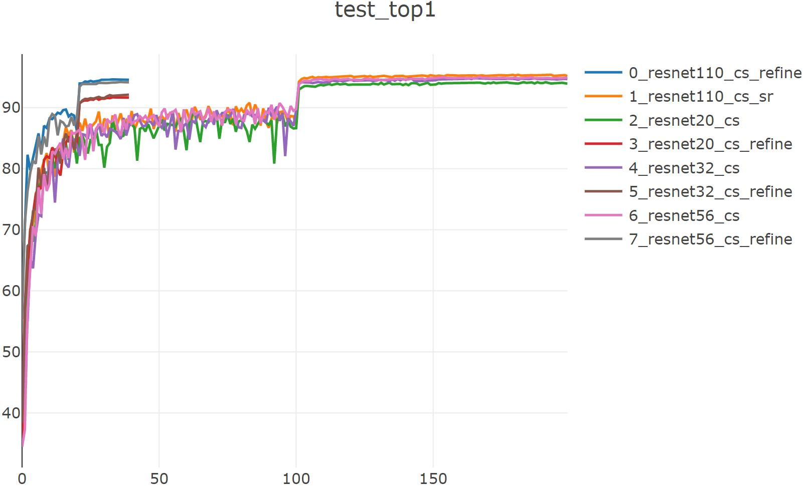

# pytorch-slimming

论文地址：[Learning Efficient Convolutional Networks Through Network Slimming](https://arxiv.org/abs/1708.06519v1) (ICCV2017)

参考代码：https://github.com/foolwood/pytorch-slimming

参考代码：https://github.com/Eric-mingjie/network-slimming

## 实验（基于CIFAR10数据集）：

(resnet前几个实验训练的时候忘记-sr了，导致并没有稀疏训练，从图中可以看到没有带_sr，不过效果并没有太大影响。。日后再重新实验吧)

### resnet20_cs ('cs' means channel sellection)

sparsity training: ```python trainer_exp.py --json experiments/baseline/cifar10_resnet20_cs_sr.json --gpu 3 --visdom```

slimming: ``` python pruner_exp.py --json experiments/prune/cifar10_slimming_resnet20.json --gpu 2 --prune_percent 0.5```

fine-tune: ```python trainer_exp.py --json experiments/prune/cifar10_slimming_resnet20_fine_tuning.json --gpu 3 --visdom```

|   resnet20_cs    | Baseline: resnet20(w) | Trained with sparsity (lambda=1e-5) | slimmed (ratio=0.5) | Fine-tuned (40epochs) |
| :--------------: | :-------------------: | :---------------------------------: | :-----------------: | :-------------------: |
| Top1 Accuracy(%) |         94.04         |                94.18                |        11.7         |         91.71         |
|    Parameters    |        1.11 M         |               1.11 M                |      826.91 k       |       826.91 k        |
|   FLOPs(MMac)    |        159.95         |               160.41                |        111.2        |         111.2         |

### resnet32_cs ('cs' means channel sellection)

sparsity training: ```python trainer_exp.py --json experiments/baseline/cifar10_resnet32_cs_sr.json --gpu 3 --visdom```

slimming: ``` python pruner_exp.py --json experiments/prune/cifar10_slimming_resnet32.json --gpu 2 --prune_percent 0.5```

fine-tune: ```python trainer_exp.py --json experiments/prune/cifar10_slimming_resnet32_fine_tuning.json --gpu 6 --visdom```

|   resnet32_cs    | Baseline: resnet32(w) | Trained with sparsity (lambda=1e-5) | slimmed (ratio=0.5) | Fine-tuned (40epochs) |
| :--------------: | :-------------------: | :---------------------------------: | :-----------------: | :-------------------: |
| Top1 Accuracy(%) |         94.48         |                94.85                |        9.65         |         92.12         |
|  Parameters(M)   |         1.89          |                1.89                 |        1.34         |         1.34          |
|   FLOPs(MMac)    |        273.77         |               274.52                |       194.62        |        194.62         |

### resnet56_cs ('cs' means channel sellection)

sparsity training: ```python trainer_exp.py --json experiments/baseline/cifar10_resnet56_cs_sr.json --gpu 6 --visdom```

slimming: ``` python pruner_exp.py --json experiments/prune/cifar10_slimming_resnet56.json --gpu 2 --prune_percent 0.5```

fine-tune: ```python trainer_exp.py --json experiments/prune/cifar10_slimming_resnet56_fine_tuning.json --gpu 3 --visdom```

|   resnet56_cs    | Trained with sparsity (lambda=1e-5) | slimmed (ratio=0.5) | Fine-tuned (40epochs) |
| :--------------: | :---------------------------------: | :-----------------: | :-------------------: |
| Top1 Accuracy(%) |                95.04                |        10.45        |         94.22         |
|  Parameters(M)   |                3.44                 |        2.35         |         2.35          |
|   FLOPs(MMac)    |               502.73                |       359.39        |        359.39         |

### resnet110_cs ('cs' means channel sellection)

sparsity training: ```python trainer_exp.py --json experiments/baseline/cifar10_resnet110_cs_sr.json --gpu 6 --visdom```

slimming: ``` python pruner_exp.py --json experiments/prune/cifar10_slimming_resnet110.json --gpu 2 --prune_percent 0.5```

fine-tune: ```python trainer_exp.py --json experiments/prune/cifar10_slimming_resnet110_fine_tuning.json --gpu 3 --visdom```

|   resnet110_cs   | Trained with sparsity (lambda=1e-5) | slimmed (ratio=0.5) | Fine-tuned (40epochs) |
| :--------------: | :---------------------------------: | :-----------------: | :-------------------: |
| Top1 Accuracy(%) |                95.39                |        10.42        |         94.66         |
|  Parameters(M)   |                6.94                 |        4.56         |         4.56          |
|   FLOPs(MMac)    |              1.02 GMac              |     741.71 MMac     |      741.71 MMac      |

## 可视化：

带refine的为fine-tuning

### test_top1:



### vgg19_bn_cifar

(早期实验，工程重构后没有重新实验)

sparsity training: ```python trainer.py --arch vgg19_bn_cifar --epochs 150 --gpu 4 --valuate -sr --visdom --srl 1e-4```

slimming: ```python slimmer.py --arch vgg19_bn_cifar --gpu 4 --resume checkpoints/sparsity/cifar10_vgg19_bn_cifar_sr_best.pth.tar --slim 0.7```

fine-tune: ```python trainer.py --arch vgg19_bn_cifar --epochs 10 --gpu 4 --valuate --resume checkpoints/slimmed_ratio0.7_cifar10_vgg19_bn_cifar_checkpoint.pth.tar --refine```

|  vgg19_bn_cifar  | Baseline | Trained with sparsity (lambda=1e-4) | slimmed (ratio=0.7) | Fine-tuned (10epochs) |
| :--------------: | :------: | :---------------------------------: | :-----------------: | :-------------------: |
| Top1 Accuracy(%) |  93.26   |                94.02                |        10.00        |         92.64         |
|  Parameters(M)   |  20.04   |                20.04                |        2.49         |         2.49          |
|   FLOPs(GMac)    |   0.4    |                 0.4                 |        0.22         |         0.22          |

|             Pruned Ratio             |     0      |     0.1     |     0.2     |    0.3    |    0.4     |    0.5     |    0.6     |    0.7     |
| :----------------------------------: | :--------: | :---------: | :---------: | :-------: | :--------: | :--------: | :--------: | :--------: |
| Top1 Accuracy (%) without Fine-tuned |   93.26    |    93.93    |    93.96    |   93.95   |   94.01    |   94.03    |   94.05    |   93.01    |
|      Parameters(M)/ FLOPs(GMac)      | 20.04/ 0.4 | 15.93/ 0.35 | 12.36/ 0.31 | 9.4/ 0.28 | 6.82/ 0.25 | 4.62/ 0.24 | 3.25/ 0.23 | 2.49/ 0.22 |

| Slimmed Ratio |                         architecture                         |
| :-----------: | :----------------------------------------------------------: |
|       0       | [64, 64, 'M', 128, 128, 'M', 256, 256, 256, 256, 'M', 512, 512, 512, 512, 'M', 512, 512, 512, 512] |
|      0.1      | [62, 64, 'M', 128, 128, 'M', 256, 256, 253, 248, 'M', 444, 420, 421, 460, 'M', 468, 477, 461, 407] |
|      0.2      | [61, 64, 'M', 128, 128, 'M', 256, 256, 251, 242, 'M', 376, 325, 346, 403, 'M', 419, 433, 414, 301] |
|      0.3      | [59, 64, 'M', 128, 128, 'M', 256, 256, 249, 234, 'M', 289, 239, 265, 349, 'M', 372, 387, 358, 219] |
|      0.4      | [56, 64, 'M', 128, 128, 'M', 256, 256, 249, 227, 'M', 224, 144, 183, 297, 'M', 316, 344, 302, 128] |
|      0.5      | [54, 64, 'M', 128, 128, 'M', 256, 256, 249, 226, 'M', 202, 118, 141, 238, 'M', 188, 214, 198, 91] |
|      0.6      | [51, 64, 'M', 128, 128, 'M', 256, 256, 249, 224, 'M', 190, 95, 115, 136, 'M', 71, 63, 84, 91] |
|      0.7      | [49, 64, 'M', 128, 128, 'M', 256, 256, 249, 208, 'M', 116, 38, 18, 8, 'M', 14, 9, 16, 94] |