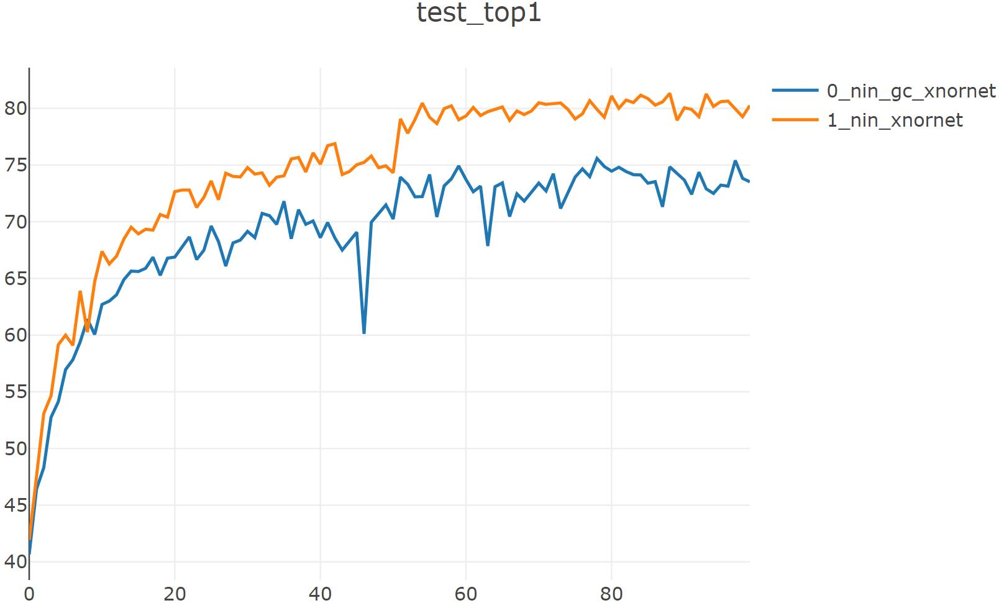
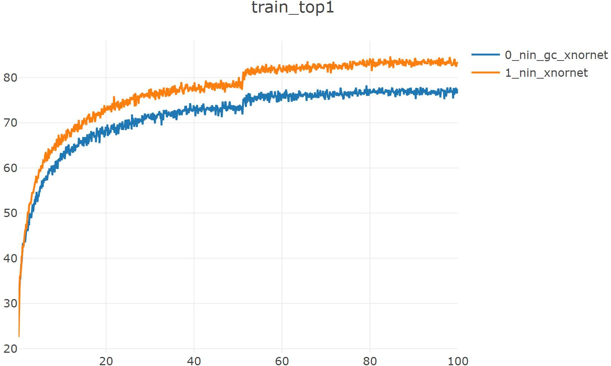

# pytorch-xnornet

[新版链接](READMEs/quantize_README.md)

论文地址：[XNOR-Net: ImageNet Classification Using Binary Convolutional Neural Networks](https://arxiv.org/abs/1603.05279v4)

参考代码：https://github.com/jiecaoyu/XNOR-Net-PyTorch

## baseline

### network-in-network baseline:

`python trainer_exp.py --arch nin --dataset cifar10 --lr 0.1 --gpu 1 --valuate --epochs 200 --deterministic --workers 1`

cfg = [192, 160, 96, 192, 192, 192, 192, 192]

groups = [1,]*9

==> Computational complexity:  0.23 GMac

==> Number of parameters:    969.82 k

...

Train: 199 [  50000/  50000 (100%)] loss:   0.009 | top1: 99.938% | load_time:   0% | lr   : 1.0e-03

Test:  199 [  10000/  10000 (100%)] loss:   0.278 | top1:  91.94% | load_time:  61% | UTC+8: 12:22:12

--------  model: nin  --  dataset: cifar10  --  duration:  0h:47.25  --------

best_acc1: 92.37

checkpoint_path: checkpoints/cifar10_nin_checkpoint.pth.tar

### network-in-network_group-conv baseline:（with channel shuffle）

`python trainer_exp.py --arch nin_gc --dataset cifar10 --lr 0.1 --gpu 1 --valuate --epochs 200 --deterministic --workers 1`

cfg = [256, 256, 256, 512, 512, 512, 1024, 1024]

groups = [1, 2, 2, 16, 4, 4, 32, 8, 1]

==> Computational complexity:  0.2 GMac

==> Number of parameters:    722.46 k

Train: 199 [  50000/  50000 (100%)] loss:    0.01 | top1: 99.974% | load_time:   0% | lr   : 1.0e-03

Test:  199 [  10000/  10000 (100%)] loss:   0.247 | top1:  92.64% | load_time:  39% | UTC+8: 10:59:53

--------  model: nin_gc  --  dataset: cifar10  --  duration:  1h:11.08  --------

best_acc1: 92.72

checkpoint_path: checkpoints/cifar10_nin_gc_checkpoint.pth.tar

## XNOR-net

### network-in-network xnornet:

`python trainer_exp.py --arch nin_xnornet --dataset cifar10 --lr 0.01 --valuate --epochs 200 --deterministic --workers 1 --gpu 0`

cfg = [192, 160, 96, 192, 192, 192, 192, 192]

groups = [1,]*9

==> Computational complexity:   17.26 MMac

==> Number of parameters:       674.91 k

...

Train: 199 [  50000/  50000 (100%)] loss:   0.443 | top1:  84.87% | load_time:   0% | lr   : 1.0e-03

Test:  199 [  10000/  10000 (100%)] loss:   0.564 | top1:  80.77% | load_time:  56% | UTC+8: 19:28:43

--------  model: nin_xnornet  --  dataset: cifar10  --  duration:  2h:13.38  --------

best_acc1: 82.75

checkpoint_path: checkpoints/cifar10_nin_xnornet_checkpoint.pth.tar

### network-in-network_group-conv xnornet:

`python trainer_exp.py --arch nin_gc_xnornet --dataset cifar10 --lr 0.1 --valuate --epochs 150 --deterministic --workers 1 --gpu 0`

==> Computational complexity:   24.71 MMac

==> Number of parameters:       589.85 k

...

Train: 149 [  50000/  50000 (100%)] loss:   0.641 | top1:  77.95% | load_time:   0% | lr   : 1.0e-03

Test:  149 [  10000/  10000 (100%)] loss:   0.766 | top1:  73.25% | load_time:  33% | UTC+8: 00:57:14

--------  nin_gc_xnornet  --  cifar10  --  best_top1: 75.620  --  duration:  2h:18.25  --------

best_acc1: 75.62

checkpoint_path: checkpoints/cifar10_nin_gc_xnornet_checkpoint.pth.tar

| model           |                    cfg                     |            groups             | Computational complexity | Number of parameters | best_acc1 |
| --------------- | :----------------------------------------: | :---------------------------: | :----------------------: | :------------------: | :-------: |
| nin baseline    |  [192, 160, 96, 192, 192, 192, 192, 192]   |            [1,]*9             |        0.23 GMac         |       969.82 k       |   92.37   |
| nin_gc baseline | [256, 256, 256, 512, 512, 512, 1024, 1024] | [1, 2, 2, 16, 4, 4, 32, 8, 1] |         0.2 GMac         |       722.46 k       |   92.72   |
| nin_xnornet     |  [192, 160, 96, 192, 192, 192, 192, 192]   |            [1,]*9             |        17.26 MMac        |       674.91 k       |   82.75   |
| nin_gc_xnornet  | [256, 256, 256, 512, 512, 512, 1024, 1024] | [1, 2, 2, 16, 4, 4, 32, 8, 1] |        24.71 MMac        |       589.85 k       |   75.62   |

